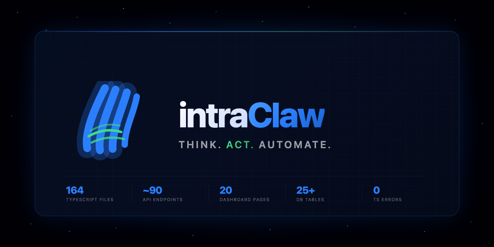

<div align="center">



<br/>

**THINK. ACT. AUTOMATE.**

*A personal AI agent platform — built from scratch, self-hosted, fully autonomous.*


</div>

---

## What is IntraClaw?

IntraClaw is a **personal AI agent** I built entirely from scratch. It connects to my tools, learns from my context, and handles complex tasks autonomously — without relying on any third-party AI platform or agent service.

Everything runs on my own infrastructure. My data never leaves my server.

---

## What it can do

### 🤖 Think & Act autonomously
- Executes multi-step tasks end-to-end with no human input
- Shows real-time reasoning steps as it works
- Automatically picks the right tools for each task
- Analyzes images, screenshots, and documents

### 🧠 Remembers everything
- Long-term memory across all conversations and tasks
- Builds a knowledge graph of people, companies, and relationships
- Runs a nightly memory synthesis to consolidate what it learned

### 💬 Talks to every platform
- Gmail, Google Calendar, Outlook
- Slack, Discord, Telegram, WhatsApp, Matrix
- Notion

### 🖥️ Writes and runs code
- Generates, edits, and tests code autonomously
- Shows a diff preview before any file change
- Automatically snapshots files — 1-click rollback at any time

### ⚙️ Automates workflows
- Visual workflow builder with scheduling
- External services can trigger tasks via webhooks
- Generates documents: PDF, Word, PowerPoint

### 🔒 Enterprise-grade security
- Two-factor authentication (TOTP)
- Social login: Google, GitHub, Microsoft
- Enterprise SSO (SAML — Okta, Azure AD, Google Workspace)
- Full audit trail, GDPR data export, consent tracking

### 📊 Self-improving
- Benchmarks its own responses and tracks quality over time
- A/B tests different prompt strategies
- Runs adversarial self-tests to catch weaknesses

### 📱 Works on mobile
- Installable as a native app (PWA — no App Store needed)
- Fully responsive dashboard
- Offline support

---

## The dashboard

A full web interface to control everything:

| | |
|---|---|
| Chat with the agent in real time | Watch reasoning steps live as they happen |
| Browse and search long-term memory | Explore the knowledge graph visually |
| Build and schedule automations | Manage calendar, email, meetings |
| Analyze images and documents | Run and test code in a sandbox |
| Manage billing and subscriptions | Configure security and SSO |

20 pages. All dark-themed. Mobile-ready.

---

## Numbers

<div align="center">

| 164 | ~90 | 20 | 25+ | 0 |
|:---:|:---:|:---:|:---:|:---:|
| TypeScript files | API endpoints | Dashboard pages | DB tables | TS errors |

</div>

---

## Tech

- **Backend:** TypeScript · Express · SQLite · ChromaDB
- **AI:** Claude API (Anthropic)
- **Dashboard:** Next.js 15 · Tailwind CSS · ReactFlow
- **Auth:** JWT · TOTP · OAuth · SAML
- **Infra:** Docker · Nginx · self-hosted

---

## Setup

```bash
git clone https://github.com/GhostNight13/IntraClaw.git
cd IntraClaw
npm install && cd dashboard && npm install && cd ..
cp .env.example .env   # add your ANTHROPIC_API_KEY
npm run setup          # guided wizard
npm run dev            # API :3001 · Dashboard :3000
```

---

<div align="center">

Built by **Ayman Idamre** — [@GhostNight13](https://github.com/GhostNight13)

*Every line of this was written intentionally.*

</div>
